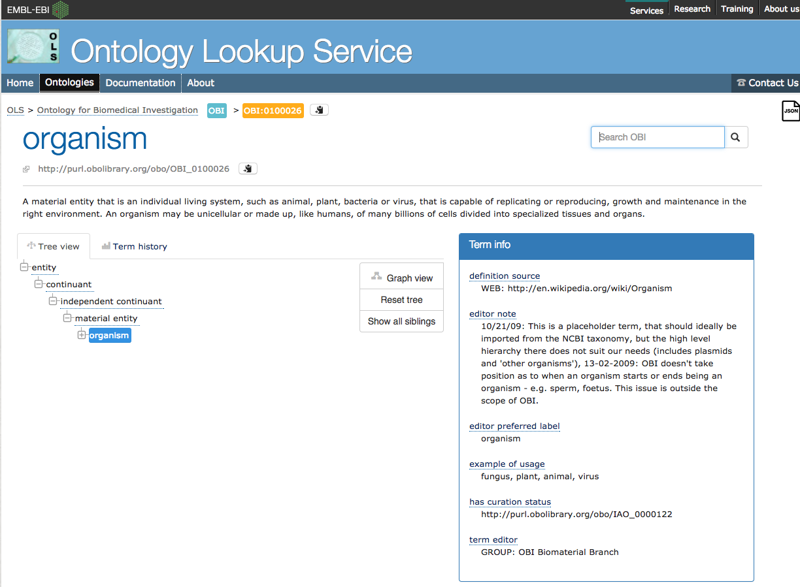
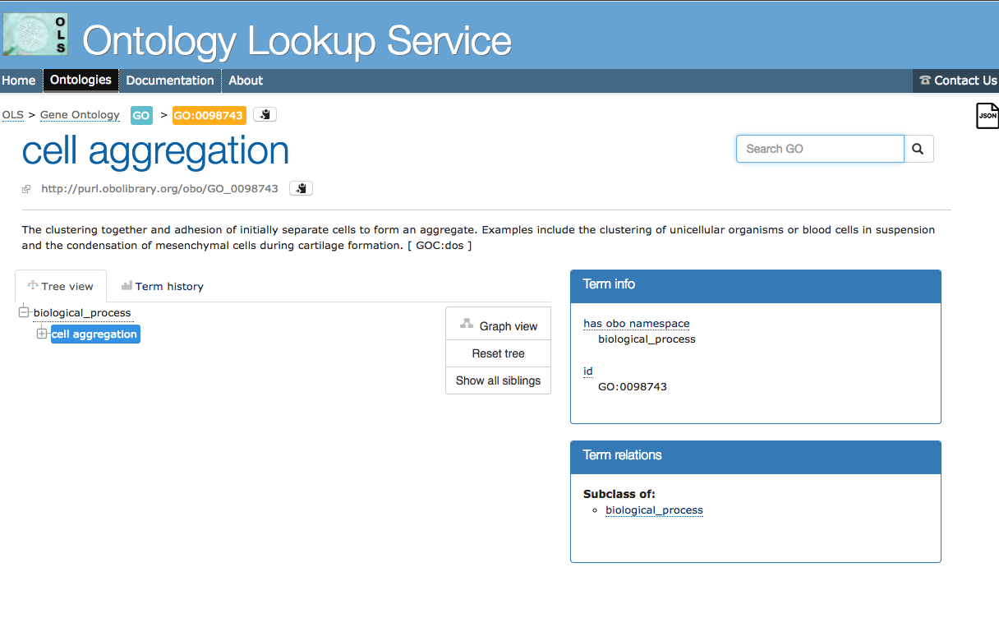
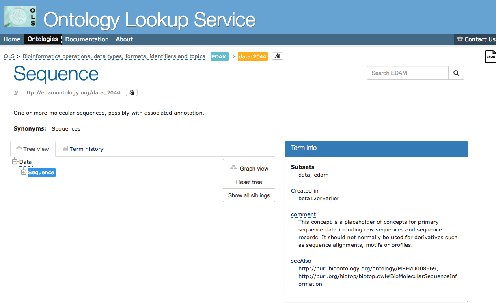

# GUIDE TO ACCESSIONS AND CVS

## Ontologies: what and why?
Tripal 3 requires all bundles and fields to be associated with a Controlled Vocabulary (CV).  CVs are dictionaries of defined terms (CVterms) that make data machine-accessible, ensuring uniform terms are used across experiments, organisms and websites.  Without CVterms, our scientific knowledge might be split by "dialects".  Plant biologists might study temperature stress, while animal biologists study heat shock.  Each group might benefit from the knowledge of the other, but they use a different vocabulary to describe the same thing, so they never discover eachother's findings.  CVterms make this easier not just for people, but especially for machines.

Ontologies take this a step further.  Where CVs were controlled lists of CVterms, ontologies are a controlled **language**, that include things like relationships.  Now we can say that heat shock is a *type of* stress, or that a gene *belongs to* an organism.

Tripal leverages this system to make way for the future of the symantic web.  Because every bundle and field you define in Tripal will be associated with a CVterm, it's important to use the [EMBL-EBI Ontology Lookup Service](http://www.ebi.ac.uk/ols/index) and to think carefully about the terms you use to describe your objects.  It's also important to understand how Chado and Tripal utilize these CVs and to be aware of some of the trickier cases.

CVs are defined in two tables in chado: DB and CV.  As you'll see below, in the simplest example, DB will be the same as CV. The terms themselves exist in CVterm.  The CVterm table has a foreign key to CV (CV\_id) and a foreign key to DB (dbxref\_id): this is how DB and CV are indirectly linked.  The term accession will always take the form of DB:accession.  This is why Chado juggles the CV and DB sometimes: it needs to consistently build URL linkouts that will go to that term in the right vocabulary.  

In some cases, the DB and CV names will not match.  For example, the sequence ontology is called **sequence** in the CV table and **SO** in the DB table.  Believe it or not, there's a reason for this: the OBO namespace for the Sequence Ontology is sequence, not SO. 


# The Golden rule

How can you tell what the DB and CV values will be for a field, without going to the table itself?  The information is in the [EMBL-EBI Ontology Lookup Service](http://www.ebi.ac.uk/ols/index).  At the top of the page, there is a *teal box* with the *CV table value* and an *orange box* with the *DB table value and accession number*. The teal box /CV table is overwritten by the *has OBO namespace* value in the Term Info table on the right side. 

Below are three examples showing this rule in action, and the corresponding insert statements.

### A simple example: Ontology for Biomedical Investigation (OBI)

In the most simple case, the DB table entry will match the CV table.  OBI terms work this way.

Consider the term for [organsim](http://www.ebi.ac.uk/ols/ontologies/obi/terms?iri=http%3A%2F%2Fpurl.obolibrary.org%2Fobo%2FOBI_0100026).  



Notice how the teal box (the CV table) is `OBI`, and the orange box is `OBI:0100026` (db table: accession).  The below call inserts the term.

```
    $term= tripal_insert_cvterm([
            'id' => 'OBI:0100026',
            'name' => 'organism',
            'cv_name' => 'OBI',
            'definition' => 'A material entity that is an individual living system, such as animal, plant, bacteria or virus, that is capable of replicating or reproducing, growth and maintenance in the right environment. An organism may be unicellular or made up, like humans, of many billions of cells divided into specialized tissues and organs.',
        ]);

```

Defining the default instance is also simple.

```
 public static $default_instance_settings  = array(
// Vocabulary here refers to the db entry.
    'term_vocabulary' => 'OBI',
    'term_name' => 'organism',
    'term_accession' => '0100026',
  
```


### Slightly less simple: Sequence Ontology

If you refer to the guide in README.md, the Sequence ontology is **SO** for DB and **sequence** for CV in chado.  Why is that?

Consider the entry for [CDS](https://www.ebi.ac.uk/ols/ontologies/so/terms?iri=http%3A%2F%2Fpurl.obolibrary.org%2Fobo%2FSO_0000316).  Both the teal and orange box use SO, so shouldn't the DB and CV be SO as well?  In this case, the `has_obo_namespace` tag set to **sequence** in the righthand box throws it off. The OBO namespace overwrites the CV name.


The resulting insert statement:


```
    $term= tripal_insert_cvterm([
            'id' => 'SO:0000316',
            'name' => 'CDS',
            'cv_name' => 'sequence',
            'definition' => 'A contiguous sequence which begins with, and includes, a start codon and ends with, and includes, a stop codon. [ http://www.sequenceontology.org/browser/current_svn/term/SO:ma ].',
        ]);

```

Defining the default instance is also simple.

```
 public static $default_instance_settings  = array(
// Vocabulary here refers to the db entry.
    'term_vocabulary' => 'SO',
    'term_name' => 'CDS',
    'term_accession' => '0000316',
  
```

Finally our field file would be named `so__cds.inc`.

Don't get mixed up when the instance asks for `term_vocabulary`!  As far as **Chado** is concerned, the `term_vocabulary` is the database.


### Medium difficulty: GO

Many ontologies are broken up into sub-ontologies.  This includes the Gene Ontology (GO) and The Encyclopedia of Genes and Genomes (KEGG), the two most popular ontologies for describing the function, location, and activities of genes and gene products.

Let's consider the example GO term [**cell aggregation**](http://www.ebi.ac.uk/ols/ontologies/go/terms?iri=http%3A%2F%2Fpurl.obolibrary.org%2Fobo%2FGO_0098743).  Looking at the EBI entry, the teal box is `GO`, the orange box is `GO:0098743`, and the has obo namespace is `biological_process`.



For this entry, the CV is biological_process, the DB is GO, and the accession is 0098743.

```
    $term= tripal_insert_cvterm([
// Vocabulary here refers to the db entry.
            'id' => 'GO:0098743',
            'name' => 'cell aggregation',
            'cv_name' => 'biological_process',
            'definition' => 'The clustering together and adhesion of initially separate cells to form an aggregate. Examples include the clustering of unicellular organisms or blood cells in suspension and the condensation of mesenchymal cells during cartilage formation.',
        ]);

```

If this term described a field, our files would be named `go__cell_aggregation`.  Our default instance settings in the field class might look like below.

```
 public static $default_instance_settings = [

// Vocabulary here refers to the db entry.  Note that its the parent vocabulary, not the subontology.

        'term_vocabulary' => 'GO',
        // The name of the term.
        'term_name' => 'cell_aggregation',
        // The unique ID (i.e. accession) of the term.
        'term_accession' => '0098743',

		... // you would also set the chado table and base table below...

    ];

```

###  The exception: EDAM

EDAM builds its term accessions using the subontology instead of the ontology.  Consider the [EDAM term for sequence](http://www.ebi.ac.uk/ols/ontologies/edam/terms?iri=http%3A%2F%2Fedamontology.org%2Fdata_2044). 
 
 the teal box is `EDAM`, the orange box is `data:2044`, and there is no obo namespace.
 
 

 The CV is therefore EDAM, the DB is data, and the accession is 2044.


```   
$term= tripal_insert_cvterm([
// Vocabulary here refers to the CV entry. 
            'id' => 'data:2044',
            'name' => 'sequence',
            'cv_name' => 'EDAM',
            'definition' => 'One or more molecular sequences, possibly with associated annotation.',
        ]);

```

For the field, the the `term_vocabulary` is the **subvocabulary** data, which is, as always, the DB table value.

```
 public static $default_instance_settings = [
// Vocabulary here refers to the db entry.  
        'term_vocabulary' => 'data',
        // The name of the term.
        'term_name' => 'sequence',
        // The unique ID (i.e. accession) of the term.
        'term_accession' => '2044',
        // Set to TRUE if the site admin is not allowed to change the term
        // type, otherwise the admin can change the term mapped to a field.
       
       ...//you would also pick the chado table and base table below...
      
    ];

```

### Local: So you've decided to cheat

If you can't find a CVterm, you can insert a term into the local CV.  This is discouraged.  Note that in this case, accession will not be numeric, but just the term name.

```
$term= tripal_insert_cvterm([
            'id' => 'local:shame_on_you',
            'name' => 'shame_on_you',
            'cv_name' => 'local',
            'definition' => 'You should really find a good CVterm.',
        ]);

```

Sometimes a good CVterm just doesn't exist for what you want to describe.  In these cases, before you use a local term, ask yourself if there is a **more general way** of describing your term.  If that doesn't help, consider contributing the term to an existing CV or ontology.

